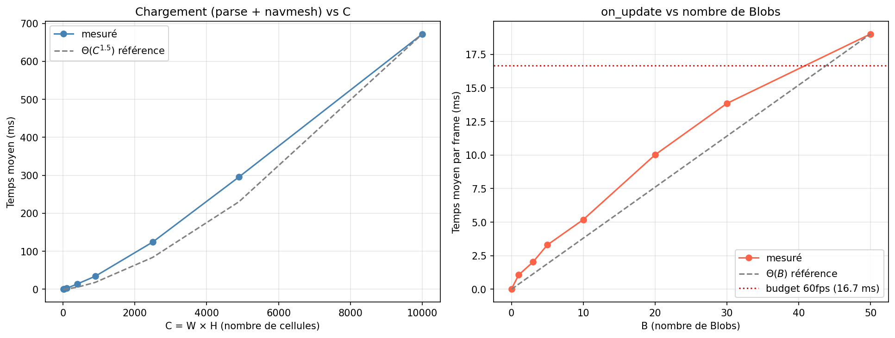

## Carte et Parsing (`map.py`, `parsing.py`)

### Vue d'ensemble

Ce module est divisé en deux fichiers aux responsabilités distinctes :

- `map.py` définit le modèle de données : les types sur lesquels repose l'ensemble du jeu.
- `parsing.py` contient la logique de chargement et de validation : il lit le format texte et produit un objet `Map` entièrement validé.

### Immuabilité de `Map` :

`Map` est définie comme un `@dataclass(frozen=True)`. Cela signifie qu'une fois construite, aucun de ses attributs ne peut être modifié. Ce choix est justifié par la nature de la carte : une fois chargée, elle ne change jamais au cours d'une partie. La rendre immuable élimine toute une catégorie de bugs liés à une modification accidentelle après chargement. (Bug liés au Navmesh, au mouvement des Spinners, etc...)

De la même manière, `SwitchConfig` et `GateConfig` sont des `@dataclass(frozen=True)`. Ce sont des objets de configuration lus depuis le fichier et utilisés en lecture seule par le reste du jeu.

La grille est stockée sous forme de `tuple[tuple[GridCell, ...], ...]`, ce qui renforce l'immuabilité : un `tuple` ne peut pas être modifié après création, contrairement à une `list`.

### Protocole de chargement :

Le chargement d'une carte se déroule en plusieurs étapes, chacune implémentée par une fonction privée dans `parsing.py` :

1. `_load_yaml`: parse l'en-tête YAML et vérifie que le résultat est un dictionnaire à clés string.
2. `_parse_header`: extrait et valide les champs obligatoires `width`, `height`, `theme`.
3. `_parse_grid`: lit la grille caractère par caractère, localise le point de départ `P`, et construit le `tuple` de cellules.
4. `_parse_switches`: valide les switches déclarés dans le YAML et vérifie leur cohérence avec la grille.
5. `_parse_gates`: valide les gates et leurs conditions d'ouverture via `_validate_condition`. (On entends ici ici par valider, vérifier la possibilité d'exister.)
6. `parse_map_doc`: regourpe l'ensemble des fonction et produit l'objet `Map` final.

Le point d'entrée public unique est `parse_map_doc(doc: str) -> Map`. Toutes les autres fonctions sont privées (préfixe `_`) et constituent des détails d'implémentation. On utilise ici `_` et non pas `__` pour pouvoir tester les fonctions.

Le chargement depuis un fichier est délégué à `load_map(file: str)` dans `map.py`, qui lit le fichier et appelle `parse_map_doc`. Ce découplage permet de tester le parsing en passant directement une chaîne de caractères sans pour autant créer un fichier map_test.

### Validation des conditions de gate

Les conditions d'ouverture des gates (`open_if`) forment une expression logique imbriquée supportant les opérateurs `switch_is_on`, `and`, `or`, et `not`. La validation est assurée par la fonction récursive `_validate_condition`, qui vérifie à la fois la structure de l'expression et la cohérence des identifiants de switches référencés.

Un paramètre `_depth` set à 50 protège contre une imbrication malveillante : on estime qu'un fichier avec plus de 50 opérateur imbriqué n'est pas très réaliste et qu'il s'agit donc probablement d'un fichier malveillant.

### Séparation des responsabilités

`map.py` ne connaît pas `parsing.py`. La dépendance est unidirectionnelle : le parser connaît le modèle de données, mais le modèle ignore le parser. L'import de `parse_map_doc` permet d'éviter un import circulaire et une erreur à la compilation.


## Joueur (`player.py`)

### Vue d'ensemble

`Player` hérite de `arcade.TextureAnimationSprite` et centralise tout l'état du joueur : direction, mouvement, armes équipées et points de vie. Elle reçoit les instructions claviers 'darcade et les convertis en changement de vitesse et d'animation.

### Gestion du clavier : la pile de touches

Le mouvement est géré par deux piles privées, `_horizontal_stack` et `_vertical_stack`, qui enregistrent l'ordre dans lequel les touches sont pressées. Lorsque deux touches opposées sont maintenues en même temps (par exemple LEFT et RIGHT), c'est **la dernière pressée qui l'emporte**, car elle se trouve en fin de pile.

Ce mécanisme résoud le problème que l'on rencontrait au début lorsque le sprite s'arrêtait de bouger si deux fleches de directions opposées étaient préssées.

### Encapsulation

Les attributs internes sont marqués privés avec `_` :

- `_direction` : la direction courante du joueur, exposée en lecture seule via la propriété `direction`.
- `_horizontal_stack` / `_vertical_stack` : détails d'implémentation du système de touches, non accessibles de l'extérieur.

Les attributs accessibles par `GameView` restent publics : `equipped_weapons`, `current_weapon`, `is_attacking`, `health_bar`.

Les méthodes privées `_add_key`, `_update_movement` et `_select_animation` ne font pas partie de l'interface publique de la classe.

### Délégation des points de vie

`Player` ne gère pas lui-même les points de vie : il délègue entièrement à `HealthBar`. La méthode `take_hit()` de `Player` appelle simplement `self.health_bar.take_hit()`.

## Armes (`weapons.py`, `sword.py`, `boomerang.py`)

### Vue d'ensemble

Ce module implémente le système d'armes du joueur à l'aide d'un polymorphisme de sous-typage:

```
arcade.TextureAnimationSprite
    └── Weapons (ABC)
            ├── Sword
            └── Boomerang
```

`Weapons` définit l'interface abstraite commune. `Sword` et `Boomerang` en sont les deux implémentations concrètes, avec des comportements distincts.

### `Weapons` — classe abstraite

`Weapons` hérite à la fois de `ABC` et de `arcade.TextureAnimationSprite`. Cela permet à chaque arme d'être à la fois un sprite Arcade (affiché, positionné, animé) et d'imposer sa structure aux classes qui la prolongent.

L'interface abstraite impose quatre méthodes à toute arme :
- `attack()`: déclenche l'attaque
- `deactivate()`: interrompt l'attaque et remet l'arme en état inactif
- `update_weapon(delta)`: met à jour l'état de l'arme à chaque frame
- `is_active` (propriété): indique si l'arme est en cours d'utilisation

### `Sword` — arme de mêlée

`Sword` utilise un enum `SwordState` à deux états (`inactive`, `active`) pour modéliser son cycle de vie. L'état est contrôlé par un minuteur (`elapsed_time`) : l'attaque dure `SWORD_ATTACK_DURATION` secondes, après quoi `deactivate()` est appelé automatiquement.

`Sword` maintient une référence directe au `Player` pour synchroniser sa position (l'épée apparaît devant le joueur selon sa direction) et son état d'attaque (`player.is_attacking`).

### `Boomerang` — projectile à retour

`Boomerang` utilise un enum `BoomerangState` à trois états (`inactive`, `launching`, `returning`) pour modéliser sa trajectoire aller-retour. La méthode `update_weapon` dispatche sur cet état via `match/case`.

En phase `launching`, le boomerang avance à vitesse constante jusqu'à une distance maximale de 8 tuiles. Il passe alors en phase `returning`.

En phase `returning`, `return_to_player` recalcule à chaque frame un vecteur normalisé vers le joueur et l'applique comme vélocité. Cela permet au boomerang de suivre le joueur s'il se déplace pendant le retour.

### Polymorphisme

`GameView` manipule toutes les armes via l'interface `Weapons` sans connaître les types concrets : `weapon.attack()`, `weapon.update_weapon(delta)`, `weapon.is_active`. Cela nous permet d'ajouter une nouvelle arme en créant une sous-classe de `Weapons` sans modifier `GameView` et sans recommencer de 0 la gestion des armes.


## `Monster` — classe abstraite (`monster.py`)

`Monster` suit le même patron que `Weapons` : héritage multiple de `ABC` et `arcade.TextureAnimationSprite`.

```
arcade.TextureAnimationSprite
    └── Monster (ABC)
            ├── Spinner
            ├── Bat
            ├── Blob
            └── Boss
```

Le cycle de vie d'un monstre est modélisé par l'enum `MonsterState` (`alive` → `dying` → `dead`). La logique de mort est entièrement encapsulée dans `Monster` via `update_death` et `start_dying` : les sous-classes n'ont pas à gérer cela.

La propriété abstraite `death_animation` force chaque monstre à définir sa propre animation de mort, sans que `Monster` ait besoin de connaître les assets.


### `Spinner` — rebond sur limites pré-calculées

Le `Spinner` se déplace à vitesse constante sur un seul axe et rebondit lorsqu'il atteint une borne. Ses bornes (`SpinnerLimits`) sont calculées une seule fois à l'initialisation par `compute_limits`, indépendamment d'Arcade, en parcourant la carte jusqu'au premier `Bush` dans chaque direction. Cela garantit la testabilité sans fenêtre graphique.

La généralisation horizontale/verticale utilise un tuple `(position, limite, getter)` qui factorise les deux cas en une seule boucle.


### `Bat` — mouvement aléatoire borné

Le `Bat` n'a pas de pathfinding. Son mouvement est entièrement géré à chaque frame par `update_monster` en quatre étapes :

1. **Déplacement** : application de `change_x` / `change_y`.
2. **Rebond sur les bords de la map** : si le bat sort des limites en pixels, sa composante de vitesse sur l'axe concerné est inversée.
3. **Rappel vers l'origine** : si la distance à `origin` dépasse `radius` (3 tuiles), la direction est recalculée vers le centre de la zone. Cela confine le bat à une zone sans contrainte de grille.
4. **Perturbation aléatoire** : à chaque frame, avec une probabilité de 20%, la direction est légèrement modifiée. La nouvelle direction est un mélange pondéré entre la direction actuelle (80%) et un vecteur aléatoire (20%). Ce biais empêche les changements de direction brusques et donne un mouvement organique.


### `Boss` — machine d'états avec HealthBar

Le `Boss` est un monstre immobile qui lance des bombes. Son comportement est géré par une machine d'états à trois états (`idle`, `attacking`, `hit`) via `_enter_state`, qui centralise les transitions et les changements d'animation.

Contrairement aux autres monstres, le `Boss` surcharge `take_hit` pour gérer plusieurs points de vie via `HealthBar` : il ne meurt que lorsque ses HP tombent à zéro, sinon il passe en état `hit`.

`on_death` et `draw_extras` sont des points d'extension du patron Template Method hérité de `Monster`. `on_death` ouvre les coffres à la mort du boss. `draw_extras` dessine les bombes en vol et la barre de vie.


### `navmesh.py` — graphe de navigation :

Chaque tuile est subdivisée en `SUBDIVISIONS² = 9` sous-nœuds, disposés en grille 3×3 à l'intérieur de la tuile. Un nœud de tuile `(i, j)` génère les sous-nœuds aux coordonnées entières `(i * 2*SUBDIVISIONS + (2k+1), j * 2*SUBDIVISIONS + (2p+1))` pour `k, p ∈ {0, 1, 2}`.

Les nœuds sont représentés comme des `tuple[int, int]`. Ce choix est délibéré : les entiers permettent une égalité exacte (`==`), un hachage fiable (les tuples flottants sont sujets aux erreurs d'arrondi), et une appartenance efficace à un ensemble ou un graphe NetworkX (`node in graph`). Travailler en coordonnées flottantes aurait rendu ces opérations fragiles.

La conversion vers l'espace pixel se fait via `subnode_to_pixel(x) = x * TILE_SIZE / (2 * SUBDIVISIONS)`, et l'inverse via `pixel_to_subnode(x) = round(x * 2 * SUBDIVISIONS / TILE_SIZE)`. Le `round` garantit que l'on retombe toujours sur un entier valide.

Le pathfinding a d'abord été implémenté avec l'algorithme de Dijkstra, mais le temps de calcul s'est révélé trop élevé sur les grandes cartes. Nous avons donc opté pour l'implémentation A* de NetworkX, qui réduit l'espace exploré grâce à une heuristique. Après recherche, l'heuristique octile s'est avérée la plus adaptée aux jeux 2D où les 8 directions de déplacement sont autorisées : elle tient compte des diagonales et sous-estime toujours le coût réel, ce qui garantit l'optimalité du chemin trouvé.

### `Blob` :

Le `Blob` a deux comportements qui s'alternent selon la visibilité du joueur :

- **Patrouille** : si le joueur n'est pas visible, le Blob choisit aléatoirement une destination parmi `possible_destinations`, une liste pré-calculée à l'initialisation dans un rayon de `PATROL_RADIUS` tuiles.
- **Poursuite** : si `can_see_player()` retourne `True` (ligne de vue via `arcade.has_line_of_sight`), le Blob recalcule son chemin vers la tuile du joueur. Le recalcul n'est déclenché que si le joueur a changé de tuile (`_last_player_tile`), évitant un appel A* à chaque frame.

Le déplacement suit le chemin nœud par nœud via `follow_path`.

## Switches et Gates (`switch.py`, `gate.py`)

### `Switch`

`Switch` est un simple sprite activable. Sa seule responsabilité est de maintenir un état booléen `is_on` et de mettre à jour sa texture à chaque `toggle()`. Il ne connaît pas les gates et n'a aucune logique de condition.

### `Gate` et évaluation des conditions

`Gate` hérite de `WallObstacle`. À chaque frame, `GameView` appelle `update_state(switches_dict)`, qui évalue la condition `open_if` et met à jour la texture (ouverte ou fermée).

La condition est évaluée récursivement par `evaluate_condition`, qui utilise le **pattern matching structurel** de Python (`match/case` sur la forme du dictionnaire). Cela permet d'exprimer proprement les quatre cas du langage de conditions :

```python
{"switch_is_on": id}   → vérifie l'état du switch
{"and": [...]}         → toutes les sous-conditions vraies
{"or": [...]}          → au moins une sous-condition vraie
{"not": [cond]}        → inverse la sous-condition
```

Ce langage est validé à la compilation (au parsing) par `_validate_condition` dans `parsing.py`, ce qui garantit qu'aucune condition invalide n'atteint `evaluate_condition` à l'exécution.

La séparation entre validation (parsing) et évaluation (gate) est une décision de conception délibérée : le parser détecte les erreurs tôt et avec des messages précis, tandis que `evaluate_condition` reste simple et sans gestion d'erreur.

## Barre de vie (`healthbar.py`)

`HealthBar` est une classe autonome qui centralise trois responsabilités liées aux HP : comptabiliser les points de vie, gérer l'invincibilité temporaire après un coup, et dessiner la barre à l'écran.

`take_hit()` retourne `True` si le personnage est mort (HP ≤ 0), `False` sinon — y compris si le coup est bloqué par la fenêtre d'invincibilité. Cela permet à l'appelant (`Player.take_hit`, `Boss.take_hit`) de réagir sans connaître les détails internes.

L'invincibilité temporaire (`__invincibility_timer`) empêche plusieurs coups d'être encaissés en rafale. Elle est décrémentée à chaque frame par `update(delta_time)` et vérifiée au début de `take_hit`. Cette logique est entièrement contenue dans `HealthBar` : ni `Player` ni `Boss` n'ont à la gérer.


## Objets de jeu secondaires (`wall_obstacle.py`, `chest.py`, `crystal_gate.py`)

`WallObstacle` est une classe abstraite commune à `Gate` et `CrystalGate`. Elle impose la propriété `is_open` et fournit `sync_wall`, qui ajoute ou retire le sprite de la liste de murs physiques selon son état — centralisant ainsi la logique de collision en un seul endroit.

`Chest` est un sprite à trois états (`closed` → `opening` → `open`) géré par `update_chest`. Son ouverture est déclenchée par `Boss.on_death()` via le patron Template Method, et une collision avec le joueur en état `open` déclenche la victoire.

`CrystalGate` hérite de `WallObstacle` et s'ouvre dès que le compteur de cristaux restants atteint zéro. Sa condition d'ouverture est volontairement simple : pas de logique booléenne, juste `crystal_count == 0`.


## Vue principale (`gameview.py`)

`GameView` est le chef d'orchestre du jeu : il ne contient pas de logique métier mais coordonne tous les autres modules. Son `__init__` instancie l'ensemble des sprites à partir d'un objet `Map` immuable, parcourant la grille cellule par cellule via un `match/case` exhaustif — `assert_never` garantit une erreur de compilation si un nouveau `GridCell` n'est pas géré.

`on_update` est découpé en cinq méthodes privées : `_update_player`, `_update_monsters`, `_collect_crystals`, `_update_combat`, `_update_switch_and_gate` et `_update_chest_and_crystal_gate`. Ce découpage évite une méthode monolithique et rend chaque responsabilité lisible isolément.

La transition entre les deux cartes (`MAP_DECOUVERTE` → `MAP_BOSS`) est déclenchée dans `_update_chest_and_crystal_gate` lorsque tous les cristaux sont ramassés et que le joueur franchit la crystal gate. Le flag `boss_room_entered` empêche de re-déclencher cette transition si on revient sur la carte de départ.

`pan_camera_to_player` implémente une dead zone : la caméra ne bouge que lorsque le joueur sort d'une zone centrale de 40 % de l'écran, puis rattrape sa position par interpolation linéaire (`lerp`).


## HUD et écrans de transition (`overlay.py`, `gameover.py`, `gamewon.py`)

`Overlay` centralise l'affichage du HUD : score en haut à gauche, icône et nom de l'arme active en haut à droite, barre de vie en bas à droite. Les objets `arcade.Text` sont pré-alloués dans `__init__` et réutilisés chaque frame — seuls leur contenu et leur position sont mis à jour — ce qui évite de créer et détruire des objets à chaque affichage.

`GameOverView` et `GameWonView` sont deux `arcade.View` indépendantes affichant respectivement l'écran de défaite et l'écran de victoire. Elles chargent la police Zelda (`The Wild Breath of Zelda.otf`) dans `on_show_view` et créent leurs `Text` à ce moment, garantissant que la fenêtre est déjà dimensionnée. La touche ESPACE relance une nouvelle partie en instanciant `GameView(MAP_DECOUVERTE)`. L'import de `GameView` est local (dans `on_key_press`) pour éviter un import circulaire.


## Benchmark (`bench.py`)



Deux aspects ont été mesurés : le coût du chargement (parse + construction du navmesh) en fonction de la taille de la carte, et le coût de `on_update` en fonction du nombre de Blobs sur une carte 40×40.

### Chargement : parse + navmesh

Chaque tuile génère 9 sous-nœuds et un nombre constant d'arêtes — la construction du graphe est donc **Θ(C)** en théorie, avec C = W×H le nombre de cellules. En pratique, la courbe mesurée suit **Θ(C^1.5)**, un écart que nous n'expliquons pas précisément au niveau du code mais qui suggère un surcoût croissant avec la taille du graphe, probablement lié à la gestion mémoire de Python des nodes. Pour une carte 100×100 (C = 10 000), le chargement atteint ~670 ms ce qui nous semble acceptable car il n'a lieu qu'une seule fois à l'initialisation.

### `on_update` : nombre de Blobs

Pour une carte fixe, chaque Blob déclenche au plus un appel A* par frame lorsque le joueur change de tuile. La complexité théorique par frame est donc **Θ(B)**, ce que la courbe mesurée confirme. Le budget 60 fps (16.7 ms) est respecté jusqu'à ~40 Blobs ; au-delà, le temps dépasse le seuil (50 Blobs → ~19 ms).

Ces résultats reflètent également le gain apporté par les optimisations successives du pathfinding : avant l'introduction de A* et du cache `_last_player_tile`, `on_update` cumulait **5.03 s** sur le même nombre d'appels ; après optimisation, ce temps est tombé à **0.858 s**, soit une réduction d'un facteur ~6. L'essentiel du gain vient de l'heuristique octile de A* qui réduit l'espace exploré, et du recalcul conditionnel qui évite un appel A* à chaque frame lorsque le joueur n'a pas changé de tuile.
